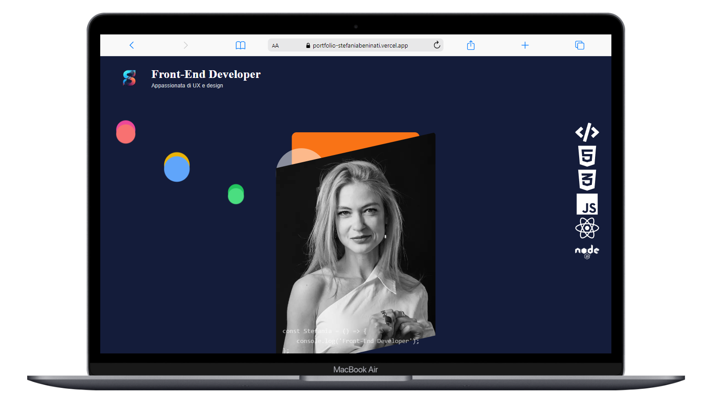

# Ania Beninati - Front-End Developer Portfolio

 

Welcome to the repository for **Ania Beninati's Front-End Developer Portfolio**! This project showcases my skills, expertise, and passion for UX/UI design and modern web development. Built using cutting-edge technologies, this portfolio is a reflection of my journey as a developer, highlighting projects, skills, and a bit about me.

## ✨ Live Demo

Check out the live version of my portfolio [here](https://portfolio-stefaniabeninati.vercel.app/).

## 🛠️ Tech Stack

This portfolio is developed using the following technologies:

- **Next.js**: A React framework for server-side rendering and static site generation.
- **Tailwind CSS**: Utility-first CSS framework for responsive design.
- **TypeScript**: Typed superset of JavaScript for improved code quality.
- **GSAP (GreenSock Animation Platform)**: For smooth and professional animations.
- **Three.js**: For interactive 3D visual elements.

## 📂 Project Structure

The project is organized as follows:

```bash
.
├── public
│   └── images            # Contains the images used in the portfolio
├── src
│   ├── components        # Reusable React components (e.g., header, skills section)
│   ├── styles            # Global and component-specific styles
│   ├── pages             # Next.js pages, including dynamic routes
│   ├── utils             # Utility functions for animations and API calls
│   └── app               # Contains the main layout and structure of the site
├── README.md             # Project documentation
├── tsconfig.json         # TypeScript configuration
├── tailwind.config.js    # Tailwind CSS configuration
└── package.json          # Project dependencies and scripts

🚀 Features
Dynamic animations: Created with GSAP to bring the content to life.
Responsive design: Optimized for all devices using Tailwind CSS.
Interactive 3D elements: Built with Three.js to enhance user experience.
Skills section: Highlights key technologies and tools I use in my development workflow.
About me section: Provides a brief background of who I am and my approach to development.
🖥️ Setup and Installation
Follow these steps to run the project locally:

Clone the repository:
git clone https://github.com/aniaBeninati/Portfolio.git

⚙️ Configuration
To customize the configuration of the project, update the following files:

tailwind.config.js: Modify the design tokens such as colors, font sizes, and breakpoints.
tsconfig.json: Adjust TypeScript settings and compiler options as needed.

🌐 Connettiti con Me
Portfolio Live Demo